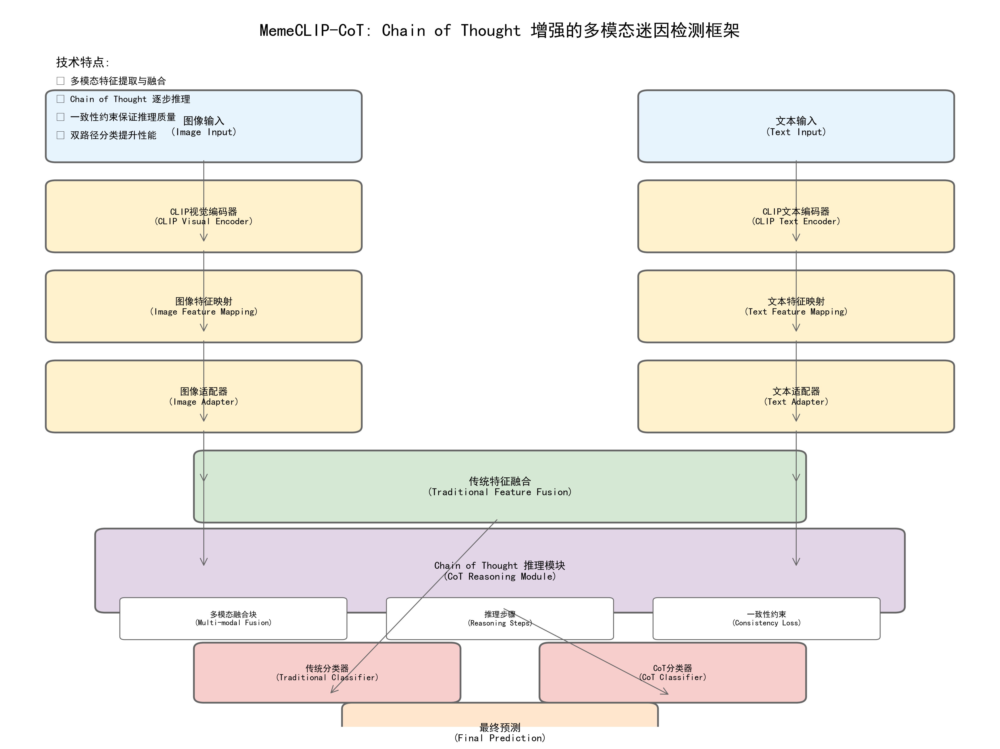

<h1 font-size:40px align="center">MemeCLIP-CoT: Chain of Thought Enhanced Multimodal Meme Detection Framework</h2>
<h3 font-size:40px align="center">Dual-Path Reasoning with Consistency Constraints</h3>

<p align="center">
  
</p>

This repository contains **MemeCLIP-CoT**, a multimodal meme detection framework that integrates **Chain of Thought (CoT) reasoning** with dual-path classification architecture. This framework introduces sophisticated reasoning mechanisms for improved meme understanding and classification.

## 🧠 Chain of Thought Enhancement

This framework introduces **Chain of Thought reasoning** to simulate human-like step-by-step reasoning processes when analyzing multimodal memes. The CoT module enables the model to:

- **Reason through complex multimodal relationships** step by step
- **Provide interpretable decision paths** for classification decisions
- **Improve performance** on complex meme understanding tasks through dual-path processing
- **Maintain consistency** across reasoning steps with built-in constraints
- **Support flexible configuration** for different reasoning depths and fusion strategies

## 📊 Supported Classification Tasks

The framework supports multiple classification tasks through flexible configuration:

### Hate Classification (Default)
|  Class | Terminology | 
| :--------: | :--------: | 
| Benign Meme | 0 | 
| Harmful Meme | 1 | 

### Target Classification
|  Class | Terminology | 
| :--------: | :--------: | 
| No particular target | 0 | 
| Individual | 1 | 
| Community | 2 | 
| Organization | 3 |

### Stance Classification
|  Class | Terminology | 
| :--------: | :--------: | 
| Neutral | 0 | 
| Support | 1 | 
| Oppose | 2 |

### Humor Classification
|  Class | Terminology | 
| :--------: | :--------: | 
| No Humour | 0 | 
| Humour | 1 | 

## 🏗️ Architecture Overview

The MemeCLIP-CoT framework features a sophisticated Chain of Thought reasoning module:

```
Input → CLIP Encoding → Feature Mapping → Adapters → CoT Reasoning → Classification
  ↓         ↓              ↓            ↓           ↓              ↓
Image/Text → CLIP Features → Mapped → Adapted → Multi-step → Final Prediction
```

### Core Components

1. **Multi-Modal Fusion Block (MFB)**: Uses factorized bilinear pooling to fuse image and text features
2. **Reasoning Steps**: Multiple attention-based reasoning steps that simulate human thinking
3. **Consistency Constraints**: Ensures logical coherence across reasoning steps
4. **Dual-Path Classification**: Combines traditional and CoT-based classification

## 🚀 Quick Start

### Installation

```bash
# Clone the repository
git clone <repository-url>
cd MemeCLIP

# Install dependencies
pip install torch torchvision pytorch-lightning
pip install clip transformers matplotlib numpy
pip install torchmetrics tqdm
```

### Configuration

All experimental settings can be configured in `code/configs.py`:

```python
# CoT Configuration
cfg.use_cot = True                    # Enable Chain of Thought reasoning
cfg.num_hops = 3                      # Number of reasoning steps
cfg.mfb_output_dim = 256             # Fusion feature dimension
cfg.mfb_factor = 8                   # MFB factorization constant
cfg.consistency_weight = 0.1         # Consistency loss weight

# Dataset Configuration
cfg.root_dir = '/path/to/dataset'
cfg.img_folder = 'path/to/images'
cfg.info_file = 'path/to/labels.csv'
cfg.checkpoint_path = 'path/to/checkpoints'
```

### Training

```bash
# Train with CoT reasoning
cd code
python main_cot.py

# Generate framework diagram
python framework_diagram.py
```

### Testing

```bash
# Test trained model
python main_cot.py  # Set cfg.test_only = True in configs.py
```

## 📁 Project Structure

```
MemeCLIP/
├── code/
│   ├── main_cot.py              # CoT training script
│   ├── MemeCLIP_CoT.py          # CoT-enhanced model implementation
│   ├── cot_modules.py           # Core CoT modules
│   ├── framework_diagram.py      # Framework visualization
│   ├── configs.py               # Configuration settings
│   ├── models.py                # Base model components
│   ├── datasets.py              # Dataset handling
│   ├── chinese_utils.py         # Chinese language utilities
│   └── README_CoT.md           # Detailed CoT documentation
├── CNmeme/                      # Chinese meme dataset
│   ├── checkpoints/             # Model checkpoints
│   ├── final_data.csv           # Dataset labels
│   └── meme/                    # Meme images
└── README.md                    # This file
```

## 🔧 Technical Implementation

### Chain of Thought Module

The CoT module consists of three main components:

1. **MultiModalFusionBlock**: Fuses image and text features using factorized bilinear pooling
2. **ReasoningStep**: Implements attention-based reasoning with feedforward networks
3. **ChainOfThought**: Orchestrates multiple reasoning steps with consistency constraints

### Loss Function

The model uses a combined loss function:

```python
total_loss = cot_loss + consistency_loss
```

Where:
- `cot_loss`: Cross-entropy loss for CoT predictions
- `consistency_loss`: Ensures reasoning step coherence

### Training Features

- **Epoch-wise Testing**: Automatic testing after each training epoch
- **Chinese Language Support**: Full Chinese interface and logging
- **GPU Optimization**: Efficient GPU memory usage
- **Progress Monitoring**: Real-time training progress visualization

## 📊 Performance & Features

### Key Improvements

- **Enhanced Interpretability**: CoT reasoning provides step-by-step decision paths
- **Improved Accuracy**: Better performance on complex multimodal understanding tasks
- **Consistency Guarantees**: Reasoning steps maintain logical coherence
- **Flexible Configuration**: Easy to adjust reasoning depth and fusion parameters

### Training Monitoring

The framework includes comprehensive logging and monitoring:

- Real-time training progress with Chinese interface
- Automatic epoch-wise testing and evaluation
- Detailed metrics tracking (accuracy, AUROC, F1-score)
- CoT-specific metrics (consistency loss, reasoning quality)

## 🎯 Use Cases

This enhanced MemeCLIP-CoT is particularly effective for:

- **Complex Meme Analysis**: Multi-layered humor, sarcasm, and cultural references
- **Hate Speech Detection**: Understanding nuanced harmful content
- **Content Moderation**: Automated moderation with explainable decisions
- **Research Applications**: Studying multimodal reasoning and interpretability

## 📚 Additional Resources

- **Detailed Documentation**: See `code/README_CoT.md` for comprehensive technical details
- **Framework Visualization**: Run `python framework_diagram.py` to generate architecture diagrams
- **Chinese Dataset**: Includes Chinese meme dataset (`CNmeme/`) for testing

## Citation

If you use this MemeCLIP-CoT framework, please cite:

```
@misc{memeclip_cot_2024,
  title={MemeCLIP-CoT: Chain of Thought Enhanced Multimodal Meme Detection Framework},
  author={Your Name},
  year={2024},
  note={Dual-Path Reasoning with Consistency Constraints}
}
```
